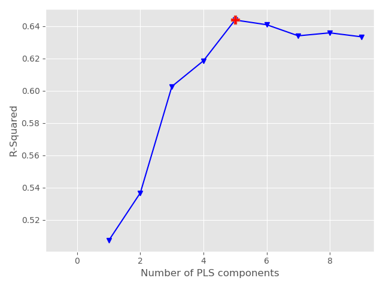
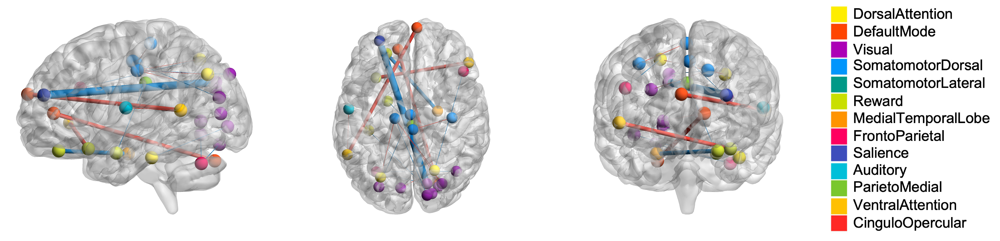
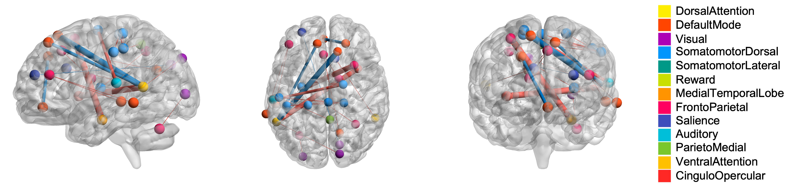
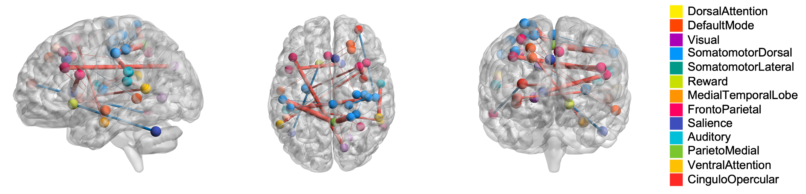

# Partial Least Square Regression for Brain Imaging

PLSBI is a *unified*, *modular* and *reproducible* package established for brain network analysis with Partial Least Square Regression. It is designed to apply PLS with accessible datasets, identify significant brain connectivity associated with given targets and foster a collaborative environment within computational neuroscience and other related communities. This library is built upon [scikit-learn](https://scikit-learn.org/stable/).


---
[](https://github.com/Wayfear/PLSBI "Go to GitHub repo")
[](https://github.com/Wayfear/PLSBI)
[](https://github.com/Wayfear/PLSBI)


---

# Installation

To install PLSBI as a package, simply run
```shell
git clone https://github.com/Wayfear/PLSBI
cd PLSBI
pip install -e .
```


<!-- ## Dataset -->

<!-- ### Brain Imaging

The path of the imaging file is provided by the parameter "--imaging". The brain imaging file should be an RData file containing two variables, "FC" and "subjid". "FC" is a group of functional connectivities stored as a 3D matrix. The last dimension of the 3D matrix is the sample size. For example, in our dataset, the size of "FC" is (279, 279, 98). "subjid" is a list containing all subject's id in "FC". The sample size of the 3D matrix should be equal to the length of "subjid" and each id in the list corresponds with a functional connectivity in order.

### Clinical Labels

The path of the label file that should contain a column named "subjid" is provided by the parameter "--clinical_file". These columns used as the prediction labels are provided by the parameter "--columns". For example, "--columns ptsdss1_categorical ptsdss2_categorical ptsdss3_categorical" can be used for our dataset.

The label file should be a CSV file, splited by ",". After parsing the label file. These columns specified by the parameter "--columns" in the label file will be used to fit the PLS model. -->


## Parameters

```python
PLSForBrainImaging(component_range=(3, 10), scale=True, 
                    max_iter=500, tol=1e-06, 
                    correlation_threshold=0.28, edge_selection_threshold=1.96, 
                    output_path='PLS_result/', repeat_time=1000)
```

- **component_range**, default=(3, 10)
The range of the number of components to search.

- **scale**, bool, default=True
Whether to scale X and y.

- **max_iter**, int, default=500
The maximum number of iterations of the power method when algorithm='nipals'. Ignored otherwise.

- **tol**, float, default=1e-06
The tolerance used as convergence criteria in the power method: the algorithm stops whenever the squared norm of $u_i - u_{i-1}$ is less than tol, where u corresponds to the left singular vector.

- **correlation_threshold**, float, default=0.28. The threshold is used to select correlated edges.

- **edge_selection_threshold**, float, default=1.96. The threshold is used to select significant brain edges.

- **output_path**, string, default="result/". The folder for storing results.

- **repeat_time**, int, default=1000. The repeat time of PLS. The PLS is training with several repetitions to identify these brain connectivity with significantly high weights.

- **folder**, int, default=5. 


## Attributes

- **x_loading**, ndarray of shape (repeat_time, n_selected_edge, n_components), n_selected_edge is the number of used ROIs, n_components is the number of component. The loadings of X.
- **y_loading**, ndarray of shape (n_targets, n_components). The loadings of y. n_targets is the number of clinical variables, n_components is the number of components. The loadings of y.

## Metric

- $R^2$ is the coefficient of determination, defined as $$1-\frac{\mu}{\nu},\mu=\sum^{n}_{i=1}()^2$$, where $\mu$ is the residual sum of squares $$ and $\nu$ is the total sum of squares $\sum^{n}_{i=1}(y_i - \bar{y}_i)^2$. The best possible score is 1.0 and it can be negative (because the model can be arbitrarily worse). A constant model that always predicts the expected value of y, disregarding the input features, would get a score of 0.0.

- MSE is mean squared error,  defined as $$\frac{1}{n}\sum^{n}_{i=1}(y_i-\hat{y_i})^2$$
 
## Functoins to call

### **fit(X, y)**

- Fit model to data.

- Parameters:
**X**, a ndarray of shape (n_samples, n_node_size, n_node_size), where n_samples is the number of subjects, n_node_size is the number of ROIs.
**y**, a ndarray of shape (n_samples, n_targets), where n_samples is the number of subjects, n_targets is the number of clinical variables.

- Return: **self**, object. Fitted model.

### predict(X)

- Predict targets of given samples.

- Parameters: 
**X**, a ndarray of shape (n_samples, n_node_size, n_node_size), where n_samples is the number of subjects, n_node_size is the number of ROIs. Samples

- Return: **y_pred**, a ndarray of shape (n_samples, n_targets). Returns predicted values.

### score(X, y)


<!-- itemline -->
- Return the coefficient of determination $R^2$ of the prediction. The coefficient of determination is applied as the evaluation metric. 


- Parameters: 
**X**, a ndarray of shape (n_samples, n_node_size, n_node_size), where n_samples is the number of subjects, n_node_size is the number of ROIs.
**y**, a ndarray of shape (n_samples, n_targets), where n_samples is the number of subjects, n_targets is the number of clinical variables.

- Return: **Score**, float. Returns the $R^2$ score.

## Usage

```python
from PLSBI import PLSForBrainImaging

pls = PLSForBrainImaging(component_range=(3, 10), scale=True, 
                    max_iter=500, tol=1e-06, 
                    correlation_threshold=0.28, edge_selection_threshold=1.96, 
                    output_path='result/', repeat_time=1000)

# X is ndarray of shape (n_samples, n_node_size, n_node_size)
# y is ndarray of shape (n_samples, n_targets)
model = pls.fit(X, y)

```


<!-- ```
usage: main.py [-h] [--output OUTPUT] [--imaging IMAGING]
               [--clinical_file CLINICAL_FILE] [--column COLUMN]
               [--correlation_threshold CORRELATION_THRESHOLD]

optional arguments:
  -h, --help            show this help message and exit
  --output OUTPUT       The folder for storing results
  --imaging IMAGING     The file contains imaging data, the format is RData
  --clinical_file CLINICAL_FILE
                        The file contains clinical variables, the format is
                        csv
  --columns COLUMNS     These columns used as the prediction labels
  --correlation_threshold CORRELATION_THRESHOLD
                        The threshold used to select correlated edges
``` -->


## Example
Here we use the PTSD dataset mentioned in our [paper]() to demonstrate the output of PLSForBrainImaging.


### Example Output

```bash
Suggested number of components:  5
When using the best component:
        R^2 Cross Validation: 0.661
        MSE Cross Validation: 0.339

## Information on X Loading
Component1, threshold: 1.96, edge num: 38
Component2, threshold: 1.96, edge num: 35
Component3, threshold: 1.96, edge num: 38
Component4, threshold: 1.96, edge num: 35
Component5, threshold: 1.96, edge num: 41
The result of Component1 saved in PLS_result/original_0_by_rank.edge
The result of Component2 saved in PLS_result/original_1_by_rank.edge
The result of Component3 saved in PLS_result/original_2_by_rank.edge
The result of Component4 saved in PLS_result/original_3_by_rank.edge
The result of Component5 saved in PLS_result/original_4_by_rank.edge

## Performance 
R2: 0.6358

## Y Loading
           Component1  Component2  Component3  Component4  Component5
Variable1   -0.089953    0.064141   -0.033195    0.109111   -0.048392
Variable2   -0.082162    0.100282    0.087243   -0.004185   -0.065318
Variable3   -0.099847    0.056474    0.022567    0.039037    0.090056
Variable4   -0.085880    0.076129   -0.106163   -0.038888    0.008044
```

### The process of finding the optimal component number
Our PLSForBrainImaging will try different component numbers and find one that best fits training data.


### Performance

**$R^2$ Cross Validation**: 0.6358

### Y Loading

The Y loading matrix is ndarray of shape (n_targets, n_components). The element in the ith row and jth column can be seen as the importance between the PSS subdimension score i and the PLSR latent component j.

|  column   | comp 1 | comp 2 | comp 3 | comp 4 | comp 5 |
|:---------:|:------:|:------:|:------:|:------:|:------:|
| Clinical1 | 0.090  | 0.064  | -0.033 | 0.109  | -0.048 |
| Clinical2 | 0.082  | 0.100  | 0.087  | -0.004 | -0.065 |
| Clinical3 | 0.100  | 0.056  | 0.023  | 0.039  | 0.090  |
| Clinical4 | 0.086  | 0.076  | -0.106 | -0.039 | 0.008  |


### X Loading

The X loading matrix is ndarray of shape (n_imaging_features, n_components). The element in the ith row and jth column can be seen as the importance between the ith imaging features and the PLSR latent component j.


### Identify significant edges by X loading

We repeat the training process several times to obtain a more robust result and identify these brain connectivity with significant edge weights. 

$P$ is denoted as the loading matrix of $X$. From $P_{i,j}$, we can know how a edge $i$ contribute to the component $j$. We assume that these more relevant edges will have greater weight in $P$. Therefore, we can select these top relevant edges in each component based on $P$.

The gained a more robust result, we train the PLSR $T$ times with the $o$ folders cross-validation. Then we obtain $P = \{P^1, \cdots, P^{T* o} \}$, then we average these $T$ result to obtain $\overline{P}$.

With $\overline{P}$, we can select these top relevant edges for each component with the edge_selection_threshold based on the z score of the loading weight for each edge.

Significant edges for each component can be found in files whose paths are "result/original_{component index}_by_rank.edge". 

<!-- We visualize these top (edge_selection_threshold = 1.96) brain connectivity in different components.





 -->