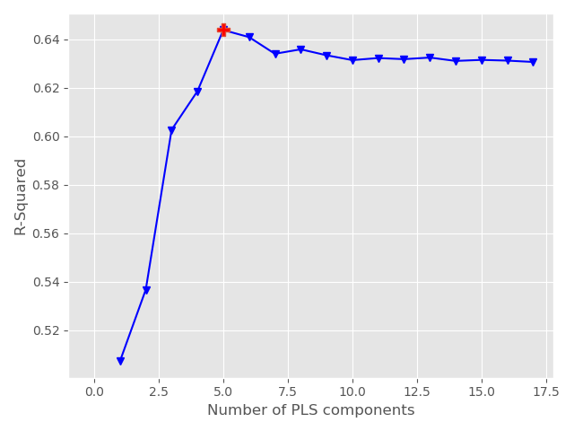

# Partial Least Square Regression for Brain Imaging

PLS-PTSD is a *unified*, *modular* and *reproducible* package established for brain network analysis with Partial Least Square Regression. It is designed to apply PLS with accessible datasets, identify significant brain connectivity associated with given targets and foster a collaborative environment within computational neuroscience and other related communities. This library is built upon [scikit-learn](https://scikit-learn.org/stable/).


---
[](https://github.com/Wayfear/PLS-PTSD "Go to GitHub repo")
[](https://github.com/Wayfear/PLS-PTSD)
[](https://github.com/Wayfear/PLS-PTSD)


---

# Installation

To install BrainGB as a package, simply run
```shell
git clone https://github.com/Wayfear/PLS-PTSD
cd PLS-PTSD
pip install -e .
```


<!-- ## Dataset -->

<!-- ### Brain Imaging

The path of the imaging file is provided by the parameter "--imaging". The brain imaging file should be an RData file containing two variables, "FC" and "subjid". "FC" is a group of functional connectivities stored as a 3D matrix. The last dimension of the 3D matrix is the sample size. For example, in our dataset, the size of "FC" is (279, 279, 98). "subjid" is a list containing all subject's id in "FC". The sample size of the 3D matrix should be equal to the length of "subjid" and each id in the list corresponds with a functional connectivity in order.

### Clinical Labels

The path of the label file that should contain a column named "subjid" is provided by the parameter "--clinical_file". These columns used as the prediction labels are provided by the parameter "--columns". For example, "--columns ptsdss1_categorical ptsdss2_categorical ptsdss3_categorical" can be used for our dataset.

The label file should be a CSV file, splited by ",". After parsing the label file. These columns specified by the parameter "--columns" in the label file will be used to fit the PLS model. -->


## Parameters

```python
PLSForBrainImaging(component_range=(3, 10), scale=True, 
                    max_iter=500, tol=1e-06, 
                    correlation_threshold=0.28, edge_selection_threshold=1.96, 
                    output_path='PLS_result/', repeat_time=1000)
```

- **component_range**, default=(3, 10)
The range of the number of components to search.

- **scale**, bool, default=True
Whether to scale X and Y.

- **max_iter**, int, default=500
The maximum number of iterations of the power method when algorithm='nipals'. Ignored otherwise.

- **tol**, float, default=1e-06
The tolerance used as convergence criteria in the power method: the algorithm stops whenever the squared norm of u_i - u_{i-1} is less than tol, where u corresponds to the left singular vector.

- **correlation_threshold**, float, default=0.28. The threshold is used to select correlated edges.

- **edge_selection_threshold**, float, default=1.96. The threshold is used to select significant brain edges.

- **output_path**, string, default="result/". The folder for storing results.

- **repeat_time**, int, default=1000. The repeat time of PLS. The PLS is training with several repetitions to identify these brain connectivity with significantly high weights.

## Usage

```python
pls = PLSForBrainImaging(component_range=(3, 10), scale=True, 
                    max_iter=500, tol=1e-06, 
                    correlation_threshold=0.28, edge_selection_threshold=1.96, 
                    output_path='PLS_result/', repeat_time=1000)

# X is ndarray of shape (n_samples, n_imaging_features), 
# Y is ndarray of shape (n_samples, n_labels), 
pls.fit(X, Y)
```


<!-- ```
usage: main.py [-h] [--output OUTPUT] [--imaging IMAGING]
               [--clinical_file CLINICAL_FILE] [--column COLUMN]
               [--correlation_threshold CORRELATION_THRESHOLD]

optional arguments:
  -h, --help            show this help message and exit
  --output OUTPUT       The folder for storing results
  --imaging IMAGING     The file contains imaging data, the format is RData
  --clinical_file CLINICAL_FILE
                        The file contains clinical variables, the format is
                        csv
  --columns COLUMNS     These columns used as the prediction labels
  --correlation_threshold CORRELATION_THRESHOLD
                        The threshold used to select correlated edges
``` -->

## Output

Here we use the PTSD dataset mentioned in our [paper]() to demonstrate the output of PLSForBrainImaging.

### The process of finding the optimal component number
Our PLSForBrainImaging will try different component numbers and find one that best fits training data.


### Performance
The coefficient of determination is applied as the evaluation metric.
R^2: 0.6358

### Y loading

The Y loading matrix is ndarray of shape (n_targets, n_components). The element in the ith row and jth column can be seen as the importance between the PSS subdimension score i and the PLSR latent component j.

|     column      | comp 1 | comp 2 | comp 3 | comp 4 | comp 5 |
|:---------------:|:------:|:------:|:------:|:------:|:------:|
|    INTRUSIVE    | 0.090  | 0.064  | -0.033 | 0.109  | -0.048 |
|    AVOIDANCE    | 0.082  | 0.100  | 0.087  | -0.004 | -0.065 |
| NEGATIVE AFFECT | 0.100  | 0.056  | 0.023  | 0.039  | 0.090  |
|   HYERAROUSAL   | 0.086  | 0.076  | -0.106 | -0.039 | 0.008  |


### X loading

The X loading matrix is ndarray of shape (n_imaging_features, n_components). The element in the ith row and jth column can be seen as the importance between the ith imaging features and the PLSR latent component j.


### Identify significant edges by X loading
To obtain a more robust result, we repeat the training process several times and identify these brain connectivity with significant edge weights. Significant edges for each component can be found in files whose paths are "result/original_{component index}_by_rank.edge". 

We visualize these top (edge_selection_threshold = 1.96) brain connectivity in different components.


